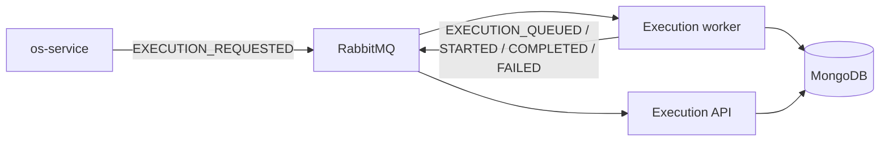

# Execution-service Architecture

The execution-service owns execution jobs, technical steps and processed event records. It does not read OS or Billing storage.

The service has two runtime adapters: in-memory for tests/local process execution and MongoDB plus RabbitMQ for real mode. MongoDB stores `execution_jobs` and `processed_events`.

Persistence and runtime bootstrap are based exclusively on MongoDB and RabbitMQ.
