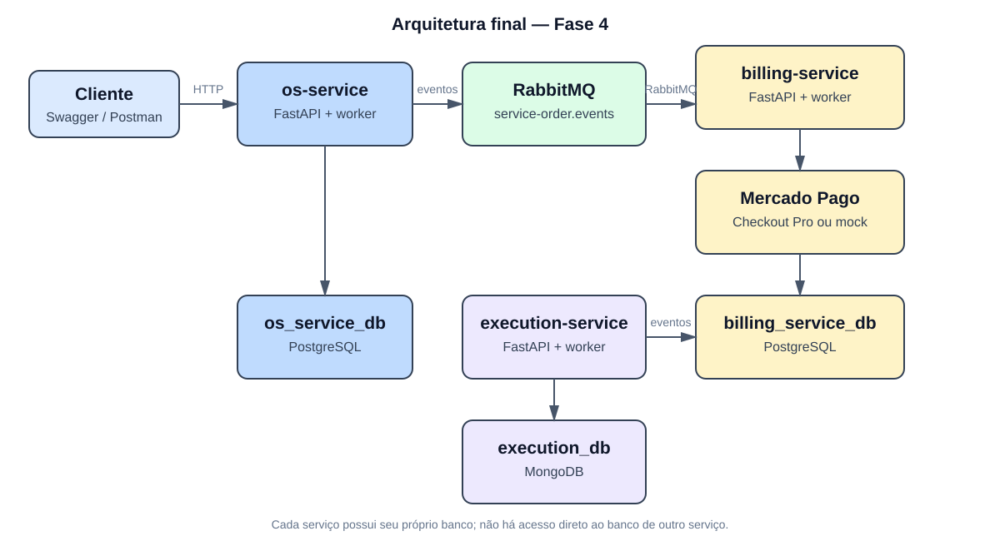

# Arquitetura final — Fase 4

Este documento descreve a arquitetura implementada no ecossistema de ordens de serviço. A mesma visão sistêmica está disponível nos três repositórios, com o foco local deste serviço ao final.

## Diagrama geral



```text
flowchart LR
    Client[Cliente / Swagger / Postman] --> OS[os-service]
    OS --> OSDB[(PostgreSQL<br/>os_service_db)]
    OS <--> MQ[RabbitMQ<br/>service-order.events]
    MQ <--> Billing[billing-service]
    Billing --> BillingDB[(PostgreSQL<br/>billing_service_db)]
    Billing --> MP[Mercado Pago ou mock]
    MQ <--> Execution[execution-service<br/>API + worker]
    Execution --> ExecDB[(MongoDB<br/>execution_db)]
```

Os três serviços têm ownership de dados separado. O `execution-service` recebe comandos por RabbitMQ e responde por eventos; não consulta PostgreSQL do `os-service` nem do Billing.

## Estratégia Saga: orquestração

O `os-service` é o orquestrador. Depois de `PAYMENT_CONFIRMED`, ele publica `EXECUTION_REQUESTED`. O `execution-service` executa somente seu passo local: cria o job, registra progresso e publica o resultado. Isso evita que o serviço de execução precise conhecer orçamento, pagamento ou regras internas da OS.

```text
sequenceDiagram
    participant OS as os-service
    participant MQ as RabbitMQ
    participant E as execution-service
    participant DB as MongoDB
    OS-)MQ: EXECUTION_REQUESTED
    MQ-)E: EXECUTION_REQUESTED
    E->>DB: persiste execution_job
    E-)MQ: EXECUTION_QUEUED
    E->>DB: atualiza diagnóstico/reparo
    E-)MQ: EXECUTION_STARTED
    E->>DB: conclui ou marca falha
    E-)MQ: EXECUTION_COMPLETED / EXECUTION_FAILED
    MQ-)OS: resultado da execução
```

O worker persiste `event_id` em `processed_events` antes de confirmar o processamento, permitindo ignorar duplicidades. A falha local publica `EXECUTION_FAILED`; a compensação e o status final da OS são responsabilidade do orquestrador.

## Papel do execution-service

- receber `EXECUTION_REQUESTED`;
- enfileirar o job e publicar `EXECUTION_QUEUED`;
- iniciar execução e publicar `EXECUTION_STARTED`;
- registrar passos de diagnóstico/reparo;
- concluir e publicar `EXECUTION_COMPLETED`, ou falhar e publicar `EXECUTION_FAILED`.

Os endpoints operacionais são `POST /executions`, `/start`, `/complete` e `/fail`. Eles servem a comandos operacionais/testes; no fluxo distribuído, o worker é acionado por `EXECUTION_REQUESTED`.

## Banco e tecnologias

MongoDB armazena documentos de execução nas coleções `execution_jobs` e `processed_events`. O formato documental permite registrar passos e metadados de execução sem impor o modelo relacional do Billing/OS. RabbitMQ, via adapters de infraestrutura, desacopla o worker do orquestrador.

Python/FastAPI fornece API e Swagger; Clean Architecture separa regras de estado do job de MongoDB, RabbitMQ e HTTP. Docker empacota API/worker; Kubernetes/k3s executa os deployments; GitHub Actions automatiza build/deploy; logs JSON com IDs de correlação apoiam a observabilidade.

## Justificativa da divisão

Execução possui comportamento operacional próprio, estados de progresso e potencial de escala diferente do financeiro e do cadastro da OS. Isolá-la reduz acoplamento e permite evoluir o armazenamento e o worker sem alterar os demais domínios. O custo da separação — consistência eventual e necessidade de eventos idempotentes — é tratado pelo contrato RabbitMQ e pela Saga orquestrada.

## Contratos consumidos e publicados

| Evento | Papel |
| --- | --- |
| `EXECUTION_REQUESTED` | consumido do `os-service`; cria o job |
| `EXECUTION_QUEUED` | publicado após persistir o job |
| `EXECUTION_STARTED` | publicado ao iniciar execução |
| `EXECUTION_COMPLETED` | publicado ao concluir todos os passos |
| `EXECUTION_FAILED` | publicado em falha de execução |

Este serviço possui somente MongoDB em runtime real (`MONGODB_URL`); não usa `DATABASE_URL`, SQLAlchemy ou Alembic para o fluxo de execução.
